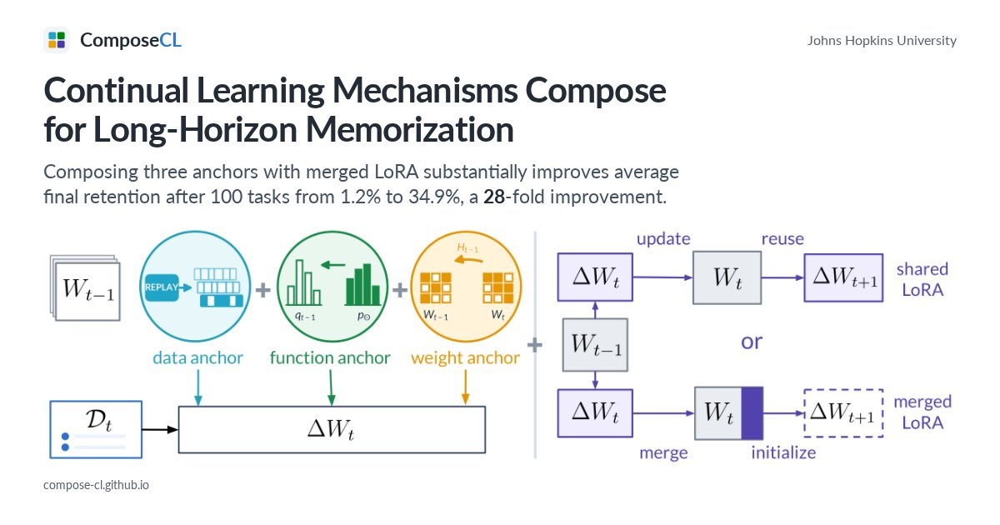

# 单个持续学习招数救不了百任务：ComposeCL 证明「组合」才有长程记忆

你有没有过这种体验：给模型塞进一批新知识，再训几轮别的东西，回头一测——前面学过的几乎全忘了。行业里管这叫 catastrophic forgetting（灾难性遗忘）；持续学习（continual learning）一堆经典招数——replay、蒸馏、EWC、LoRA——单独拿出来都「看起来有用」，但放到**很长的任务序列**上，常常集体翻车。更扎心的是：现实里知识是随时间到的，你又不能把旧训练集永远留着，推理时也没有「现在是第几个任务」这种开挂标签。

Johns Hopkins 这篇 ComposeCL（arXiv:2609.06986）就把尺子拉到 **100 个顺序 QA 任务**：全程监督微调、不保留早期训练样本、推理不给 task id。看完我的感受是：它真正要证明的不是又一个 SOTA 单体方法，而是一句工程上很硬的话——**互补机制组合起来，比任何一个单独机制都更能扛长程记忆**；全开三锚 + merged LoRA 把平均最终保留率从朴素连训的 1.2% 拉到 34.9%，大约 **28 倍**。

*图：学习任务 t 时，数据锚（replay）、函数锚（输出对齐）、权重锚（重要参数保护）共同约束 ΔW_t；右侧对比 shared LoRA 与 merged LoRA——后者把本轮更新并回基座再开新低秩因子。*

## 核心摘要

ComposeCL 定义 **long-horizon memorization**：模型要在 100 个顺序 query–answer 任务上持续 SFT，不能囤旧数据、推理时也不知道任务编号。作者把机制拆成两条设计轴——**锚（anchors）管「要保住什么」**，**低秩分配规则管「更新落在哪、怎么留给下一任务」**。三锚分别是：数据锚（用上一模型生成 replay + soft targets，不存真旧数据）、函数锚（在当前任务输入上自蒸馏对齐旧输出分布）、权重锚（SI / EWC 保护对旧任务重要的参数）；低秩一侧对比 shared LoRA 与 **merged LoRA**（每任务更新并入模型后，为下一任务初始化全新低秩因子）。他们建了三套各 100 任务的数据集（Symbol-QA / LLM-QA / Real-QA），用 **task-level successive halving** 在组合空间里粗搜，再用 **2⁴ 全因子实验**量主效应与交互。最佳组合「三锚全开 + merged LoRA」在三个数据集上都进 top 3，平均最终保留 34.9%（相对 naive 的 1.2% 约 28×）；**数据锚与 merged LoRA 平均增益最大，且在三个数据集上都呈超加性交互**。这不是「我们的 loss 更花」的论文，而是一套把持续学习当成可组合设计空间来量的协议。

## 论文信息

- **标题**：Continual Learning Mechanisms Compose for Long-Horizon Memorization
- **作者**：Zheyuan Zhang*, Alvin Zhang*, Daniel Khashabi†, Tianmin Shu†（* 同等贡献，† 同等指导）
- **机构**：Johns Hopkins University
- **链接**：https://arxiv.org/abs/2609.06986 （2026 年 9 月 7 日提交）· 项目页 https://compose-cl.github.io/

---

## 🎯 为什么要把尺子拉到 100 个任务

短 horizon 上，很多 CL 方法都能「看起来还行」：测 5–10 个任务，曲线还没来得及崩。作者的观察更刺：在他们评的单体机制里，**没有任何一个**能在 100 任务尺度上单独撑住强保留。于是假设变成可证伪的——如果遗忘来自互补源头（数据分布漂了、函数输出漂了、权重被冲了、低秩容量被占满了），那**组合**应该系统性好于单点。

这和 agent / harness 世界也有同构：你不断往 skills、MCP、记忆里塞新东西，旧能力 silently 掉——只靠「再加一个 trick」往往不够，得想清楚每个 trick 保的是哪一类不变量。

## 🏗️ 两条设计轴：保住什么 × 更新落在哪

### 三锚：同时作用，不是流水线串起来

文档强调得很清楚：三锚在学任务 t 时**一起**约束 ΔW_t，而不是先 A 再 B 再 C。W_{t-1} 与 W_t 是同一模型的相继版本。

| 锚 | 在保什么 | 做法直觉 |
| --- | --- | --- |
| 数据锚 | 过去「见过什么」 | 用上一模型生成 replay，配 soft targets；不囤真实旧训练集 |
| 函数锚 | 过去「会怎么答」 | 在当前任务输入上自蒸馏，对齐旧模型输出分布 |
| 权重锚 | 过去「哪些参数重要」 | Synaptic Intelligence / EWC 限制改动 |

### 低秩分配：shared vs merged LoRA

- **Shared LoRA**：同一套低秩适配器跨任务复用，容易把容量挤满、互相踩踏。
- **Merged LoRA**：本任务 ΔW 并回基座后，为下一任务开新的低秩因子——「给下一次更新腾地方」。主结果里的强组合都站 merged 这一边。

作者还强调：主组合相对任务数保持**常数级**的保留状态大小，而不是任务越多 adapter 堆越高——这对长 horizon 产品化很关键。

## 🧪 三套数据 + 全因子：不是只报一个赢家

三套各 100 任务、测的是「学过的 query 还能不能答上来」：

| 数据集 | 内容 | 规模直觉 |
| --- | --- | --- |
| Symbol-QA | 随机 key–value，几乎无语义捷径 | 1 万对 |
| LLM-QA | LLM 生成的虚构主题 QA，少靠预训练记忆 | 1 万对 |
| Real-QA | 公共 QA 过滤掉基座本来就会的题 | 5 千对 |

搜索上先用 **task-level successive halving**：90 个候选 → 10 / 20 / 50 任务处砍到 45 / 23 / 10，按三 seed 平均保留排序。能活到 100 的，**全都带了数据锚 + merged LoRA**——这已经是很强的筛选信号。

再开 **16 种开关组合**（三锚 × merged/shared）全因子、每数据集三 seed。项目页交互结果里，全开组合在 Symbol / LLM / Real 上分别大约 18.5% / 41.8% / 44.3% 最终保留，且是**唯一在三个数据集都进 top 3** 的组合。数据锚与 merged LoRA 的联合收益在三套数据上都超过各自增益之和（超加性）。

## 🔬 最有意思的部分：单体不够，交互才是故事

如果只记一个数「34.9%」，会低估这篇。更值得带走的是：

1. **Horizon 本身是一等公民**——短序列上的 CL 结论外推到 100 任务会骗人。
2. **组合空间要用实验设计量**——successive halving 粗筛 + factorial 拆主效应/交互，比「我们试了几个 ablation」干净。
3. **Replay（数据锚）和 merged LoRA 不是可有可无的调参**——平均增益最大，且互相放大；函数锚、权重锚是补强，不是可单独扛大梁的银弹。
4. **「不存旧数据」不等于「没有数据锚」**——用模型自己生成 replay + soft target，是在隐私/存储约束下仍想保记忆时的务实折中。

对我这种做 agent harness 的人，还有一层隐喻：skills / 记忆 / 工具配置的「持续写入」如果只有一种防护（比如只靠 prompt 提醒「别忘了旧规则」），长程一样会崩；可能需要同时保「旧例子」「旧行为分布」「旧关键权重/配置」，并想清楚更新是 merge 进主干还是永远挤在同一块低秩里。

## 🤔 我的判断

这篇的真实定位：**测量与组合协议**，附带一个强基线配方（三锚 + merged LoRA）。它把「持续学习该不该组合」从口号变成了可横向比的数字，并诚实展示：即便最佳组合，Symbol-QA 上绝对保留仍只有约两成——长程记忆远未解决，只是从「几乎归零」拉回「还能用」。

亮点三：一是 long-horizon memorization 设定（100 任务、无旧数据、无 task id）够狠够干净；二是 factorial + successive halving 把设计空间讲清楚；三是超加性交互给工程一个直接口令——优先把 **replay 类数据锚** 和 **merge 后再开新适配** 绑在一起，再考虑蒸馏与参数保护。

局限也清楚：任务是 QA 记忆协议，不是任意工具调用 agent；绝对精度离「可产品」还有距离；算力与超参细节要以论文全文为准（本文基于项目页与摘要整理）。对 Byron 的栈：若你关心 agent 长期记忆、多会话技能累积、或「不断 SFT/合并适配器会不会把旧能力冲掉」，这篇值得进关注列表；若你只做单次会话 harness 配置，当设计隐喻扫一眼即可。

一句话收束作者的野心：下一个问题不只是更好的单次微调，而是**模型能不能在上百次相继更新之后，仍然记得一路学过的东西**——ComposeCL 给的是一把量组合效应的尺子，外加目前最好用的那一套组合。

---

*觉得有启发的话，欢迎点赞、在看、转发。跟进最新 AI 前沿，关注我*
